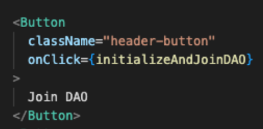

### Write Initialize Smart Contract & Join DAO Functions

Let's write the Initialize and Join DAO functions.

- Find the comment `Step C - Write Initialize Smart Contract and Join DAO Logic` in `HomeDAO.tsx` File.

- Replace the existing `initializeAndJoinDAO` function with this code snippet:

```javascript title="src/HomeDAO.ts" add={3-23}
const initializeAndJoinDAO = async () => {
  //Step C - Write Initialize Smart Contract and Join DAO Logic
  try {
    const accounts = await provider?.request({
      method: MethodsBase.ACCOUNTS,
    });
    if (!accounts) throw new Error("No accounts");

    const account = accounts?.tDVW?.[0];
    if (!account) throw new Error("No account");

    if (!initialized) {
      await DAOContract?.callSendMethod("Initialize", account, {});
      setInitialized(true);
      alert("DAO Contract Successfully Initialized");
    }

    await DAOContract?.callSendMethod("JoinDAO", account, account);
    setJoinedDAO(true);
    alert("Successfully Joined DAO");
  } catch (error) {
    console.error(error, "====error");
  }
};
```

#### Here's what the function does:

1. Fetches your wallet account using the Portkey wallet provider.

2. Initializes the DAO smart contract if it hasn't been done already, updating the state and showing a success alert.

3. Calls the JoinDAO method with your wallet address, updating the state and showing a success alert.

Now, wrap the `initializeAndJoinDAO` function in the "Join DAO" button to trigger both Initialize and JoinDAO when clicked.



Next, we'll write the **Create Proposal** function on next step