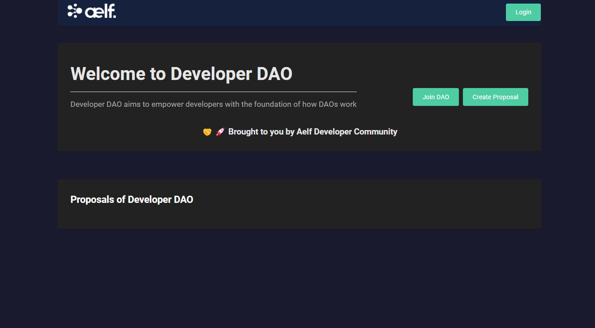
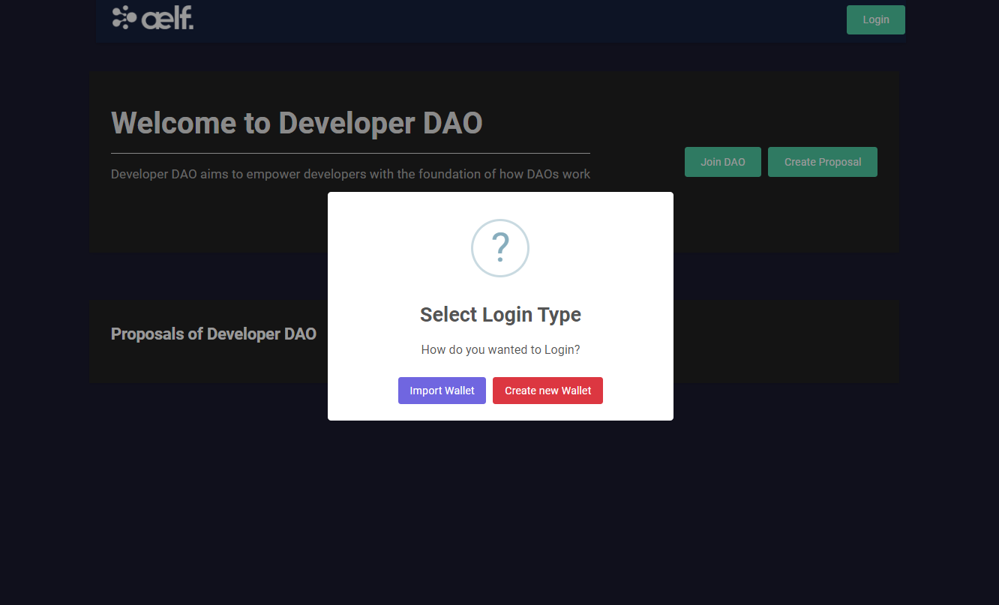
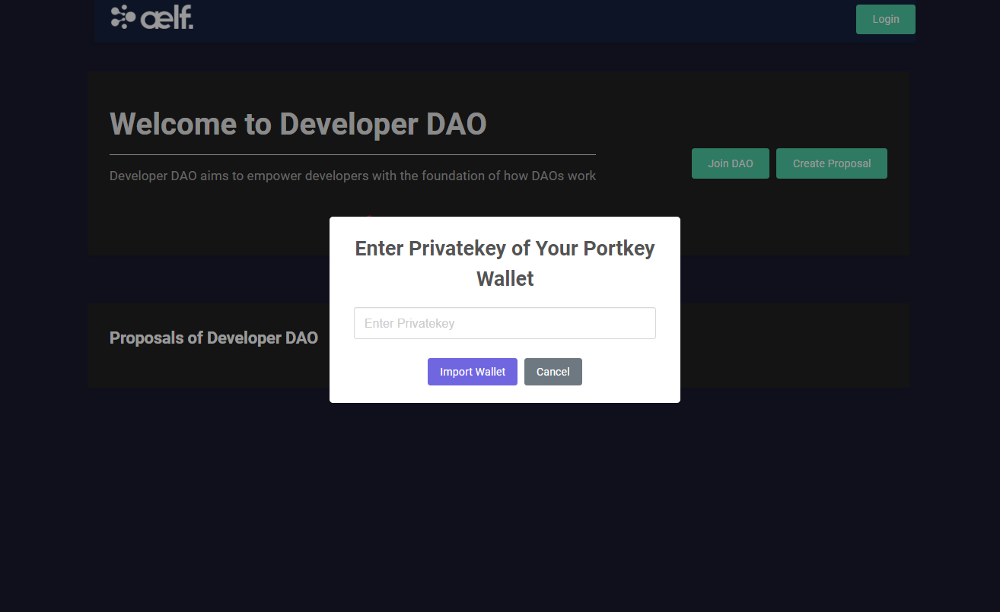
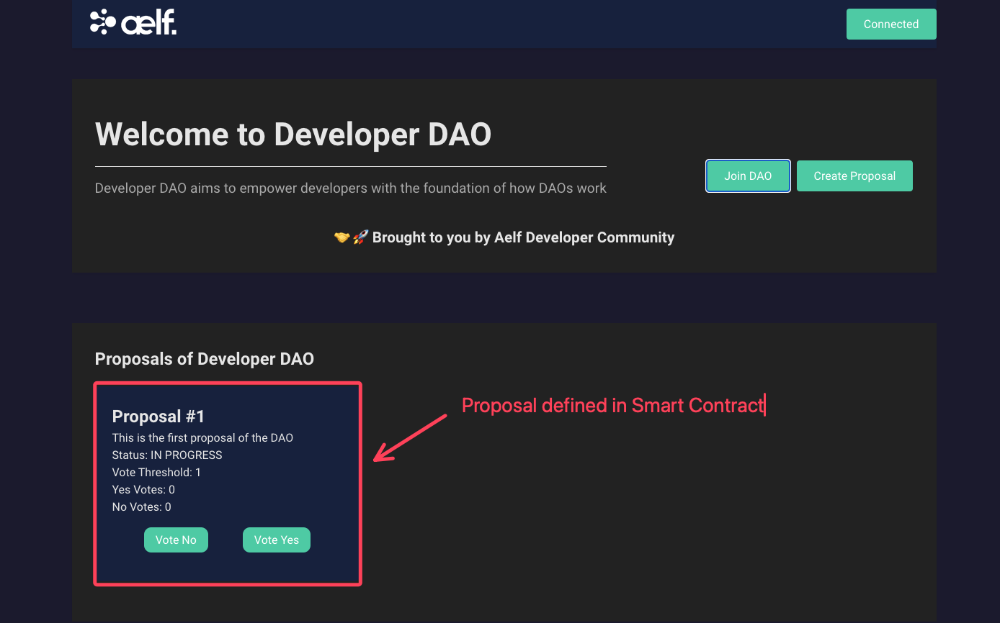
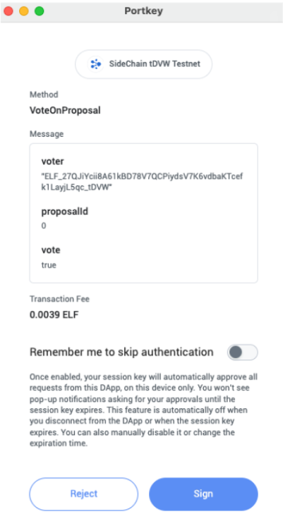
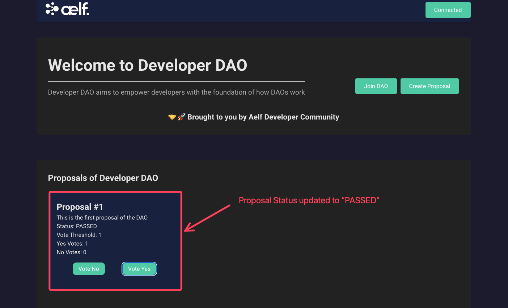
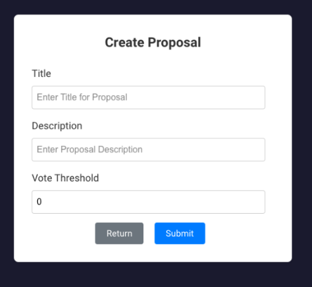
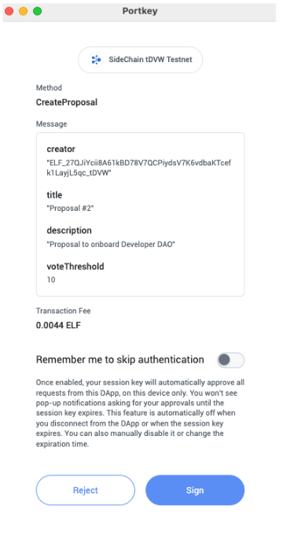
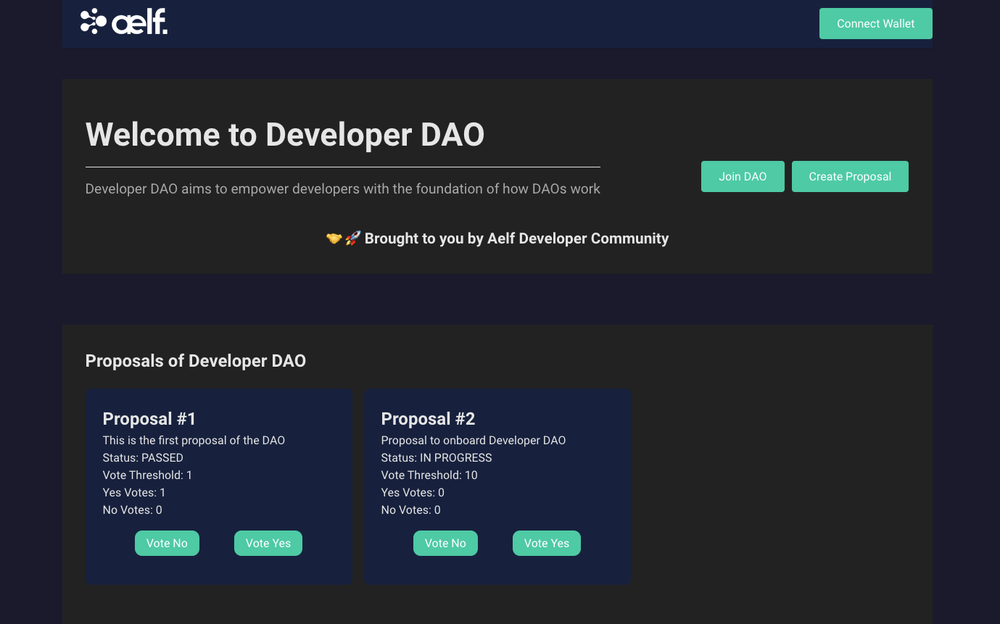

### Run Application

In this step, we will test voting functionalities.

- You should observe the following preview as shown below.

  

##### Login with Portkey Wallet

- Click on **Login** to connect your Portkey wallet. You will be get this select login options modal.

  

###### 1. Import Wallet by Privatekey 

  - Click on **Import Wallet** button and You will be get this below popup modal.

  

  - Enter the Privatekey of Portkey Wallet and Click on Import Wallet modal.

###### 2. Create Wallet

  - Click on **Create Wallet** button as shown in below popup modal.

    

The button will change from **Login** to **Connected** when the connection is successful.

- Next, click on **"Join DAO"**. You will be prompted to sign the **"Initialize"** and **"Join DAO"** methods, as shown below.

Once you have successfully joined the DAO, you should observe now that the landing page renders the proposal we have defined in our smart contract as shown below.

- Proposal #1 as defined in smart contract

:::danger
⚠️ Reminder: This proposal has been hard coded within our smart contract to test our vote functionality and is meant for educational purposes! In actual production settings, proposals should not be hardcoded within your smart contract!
:::

- Let’s test our Vote functionality next.

- Proceed to click on **"Vote Yes"** and you should observe the following as shown below prompting you to sign the **"Vote Yes"** transaction.

  

- Proceed to click on **"Sign"**.

Upon a successful vote transaction, you should now observe that the proposal status has been updated to **"PASSED"** as shown below as the Yes vote count has reached the vote threshold.

- Proposal status updated to **"PASSED"** Lastly, we will be creating a proposal to wrap up our demonstration of our Voting dApp.

- Click on **"Create Proposal"** for Proceed and you should be directed to the Create Proposal page as shown below.

  

- Proceed to fill in the following fields under the Create Proposal form:

  - **Title** - Proposal #2

  - **Description** - Proposal to onboard Developer DAO

  - **Vote Threshold** - 10

- click on **"Submit"** and you should observe the following as shown below.

  

- Click on **"Sign"** to Proceed.

- Upon a successful proposal creation, you should be directed back to the landing page with the newly created proposal rendered on the landing page as shown below.

  

:::success
🎉 Congratulations Learners! You have successfully built your Voting dApp and this is no mean feat!
:::
