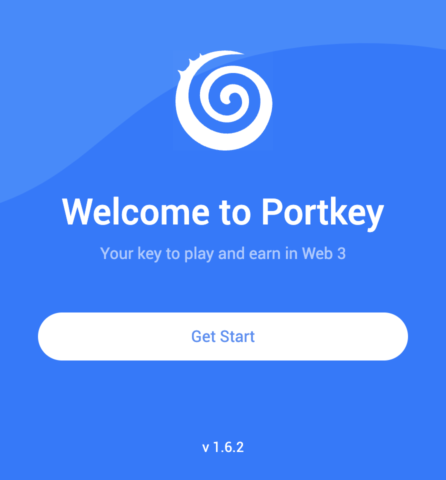
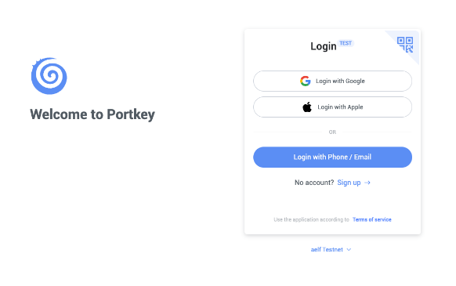
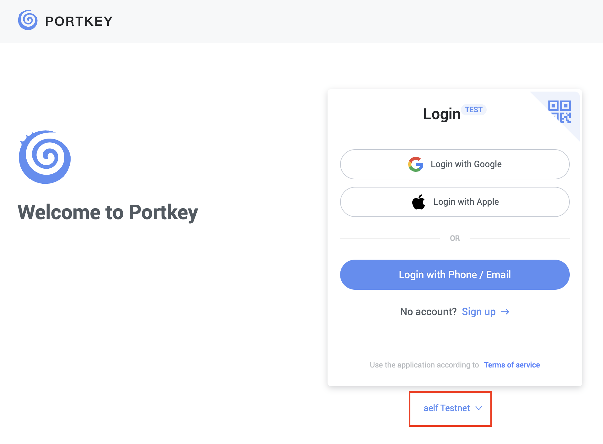
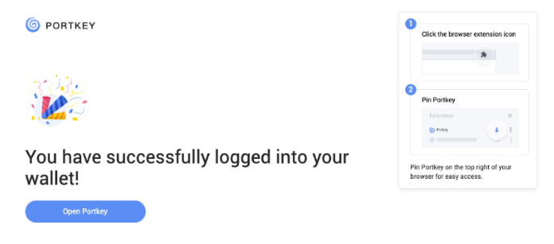
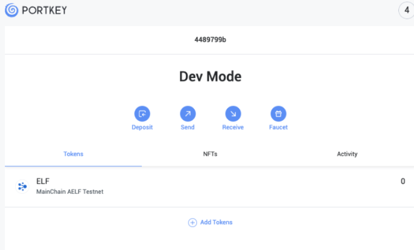

### Run Application

In this step, we will test voting functionalities.

- You should observe the following preview as shown below.

  

#### Create Portkey Wallet

:::info
Portkey is the first AA wallet from aelf's ecosystem, migrating users, developers and projects from Web2 to Web3 with DID solution.

Users can swiftly log into Portkey via their Web2 social info with no private keys or mnemonics required. Underpinned by social recovery and decentralized guardian design, Portkey safeguards users' assets from centralized control and theft. Portkey has a unique payment delegation mechanism which enables interested parties to function as delegatees to pay for user activities on users' behalf. This means that users can create accounts for free and fees for other usages may also be covered in Portkey.

Portkey also provides crypto on/off-ramp services, allowing users to exchange fiat with crypto freely. It supports the storage and management of various digital assets such as tokens, NFTs, etc. The compatibility with multi-chains and seamless connection to all kinds of DApps makes Portkey a great way to enter the world of Web3.

With DID solution as its core, Portkey provides both Portkey Wallet and Portkey SDKs.

For more information, you may visit the official documentation for Portkey at https://doc.portkey.finance/.
:::

- Download the Chrome extension for Portkey from https://chromewebstore.google.com/detail/portkey-wallet/iglbgmakmggfkoidiagnhknlndljlolb.

:::info
The Portkey extension supports Chrome browser only (for now). Please ensure that you are using Chrome browser.
You may download Chrome from https://www.google.com/intl/en_sg/chrome/.
:::

- Once you have downloaded the extension, you should see the following on your browser as shown below.

  

- Click on `Get Start` and you should see the following interface as shown below.

  

**Sign up**

- Switch to **aelf Testnet** network by selecting it:

  

:::danger
Please make sure you are using `aelf Testnet` in order to be able to receive your testnet tokens from the Faucet.
:::

- Proceed to sign up with a Google Account or your preferred login method and complete the necessary accounts creation prompts and you should observe the following interface once you have signed up.

  

With that, you have successfully created your very first Portkey wallet within seconds. How easy was that?

:::info
It is highly recommended to pin the Portkey wallet extension for easier access and navigation to your Portkey wallet!
:::

- Next, click on ‘Open Portkey’ and you should now observe the following as shown below.

  

**Connect Portkey Wallet**

- Click on **"Connect Wallet"** to connect your Portkey wallet. The button will change to **"Connected"** when the connection is successful.

- Next, click on **"Join DAO"**. You will be prompted to sign the **"Initialize"** and **"Join DAO"** methods, as shown below.

Once you have successfully joined the DAO, you should observe now that the landing page renders the proposal we have defined in our smart contract as shown below.

- Proposal #1 as defined in smart contract

:::danger
⚠️ Reminder: This proposal has been hard coded within our smart contract to test our vote functionality and is meant for educational purposes! In actual production settings, proposals should not be hardcoded within your smart contract!
:::

- Let’s test our Vote functionality next.

- Proceed to click on **"Vote Yes"** and you should observe the following as shown below prompting you to sign the **"Vote Yes"** transaction.

  

- Proceed to click on **"Sign"**.

Upon a successful vote transaction, you should now observe that the proposal status has been updated to **"PASSED"** as shown below as the Yes vote count has reached the vote threshold.

- Proposal status updated to **"PASSED"** Lastly, we will be creating a proposal to wrap up our demonstration of our Voting dApp.

- Click on **"Create Proposal"** for Proceed and you should be directed to the Create Proposal page as shown below.

  

- Proceed to fill in the following fields under the Create Proposal form:

  - **Title** - Proposal #2

  - **Description** - Proposal to onboard Developer DAO

  - **Vote Threshold** - 10

- click on **"Submit"** and you should observe the following as shown below.

  

- Click on **"Sign"** to Proceed.

- Upon a successful proposal creation, you should be directed back to the landing page with the newly created proposal rendered on the landing page as shown below.

  

:::success
🎉 Congratulations Learners! You have successfully built your Voting dApp and this is no mean feat!
:::
